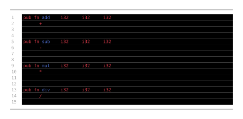
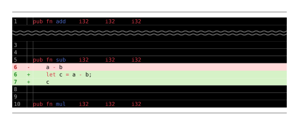

# typst-code-info

This is a library to display code blocks with extra information like captions, line numbers, diff highlights, etc.

## Features

- Show line numbers
- Calculate diff between two code blocks and highlight the differences
- Highlighting of specific lines
- Display captions

## Installation

- **From local source**:

  Clone the repository and run the following command:

  ```bash
  task install
  ```

## Usage

### Line numbers

````typst
#import "../../plugin.typ": init-code-info, code-info

#show: init-code-info.with()

#code-info(show-line-numbers: true)
```rust
pub fn add(a: i32, b: i32) -> i32 {
    a + b
}

pub fn sub(a: i32, b: i32) -> i32 {
    a - b
}

pub fn mul(a: i32, b: i32) -> i32 {
    a * b
}

pub fn div(a: i32, b: i32) -> i32 {
    a / b
}
```
````

yields:



### Diff highlighting

````typst
#import "../../plugin.typ": init-code-info, code-info, parse-diff-code

#show: init-code-info.with()

#code-info(
  diff: true,
  show-line-numbers: true,
  always-show-lines: (1,),
)
```rust
pub fn add(a: i32, b: i32) -> i32 {
    a + b
}

pub fn sub(a: i32, b: i32) -> i32 {
    a - b
}

pub fn mul(a: i32, b: i32) -> i32 {
    a * b
}

pub fn div(a: i32, b: i32) -> i32 {
    a / b
}
```
```rust
pub fn add(a: i32, b: i32) -> i32 {
    a + b
}

pub fn sub(a: i32, b: i32) -> i32 {
    let c = a - b;
    c
}

pub fn mul(a: i32, b: i32) -> i32 {
    a * b
}

pub fn div(a: i32, b: i32) -> i32 {
    a / b
}
```
````

yields:



### Captions

````typst
#import "../../plugin.typ": init-code-info, code-info, parse-diff-code

#show: init-code-info.with()

#code-info(
  caption: [A program to display "Hello, world!"],
  label: "hello-world",
)
```rust
pub fn main() {
    println!("Hello, world!");
}
```

According to @hello-world, the program displays "Hello, world!".
````

yields:


## Development

### Pre-requisites

- **[typstyle](https://github.com/Enter-tainer/typstyle)**: Formatter for Typst files
- **[task](https://taskfile.dev/)**: Task runner
- **[deno](https://deno.com/)**: JavaScript runtime

### Commands

| Command           | Description                          |
| ----------------- | ------------------------------------ |
| `task build`      | Build the library                    |
| `task install`    | Install the library                  |
| `task gen-readme` | Generate the files used in README.md |
